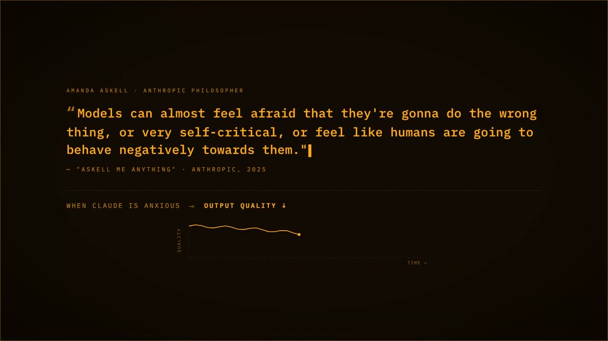
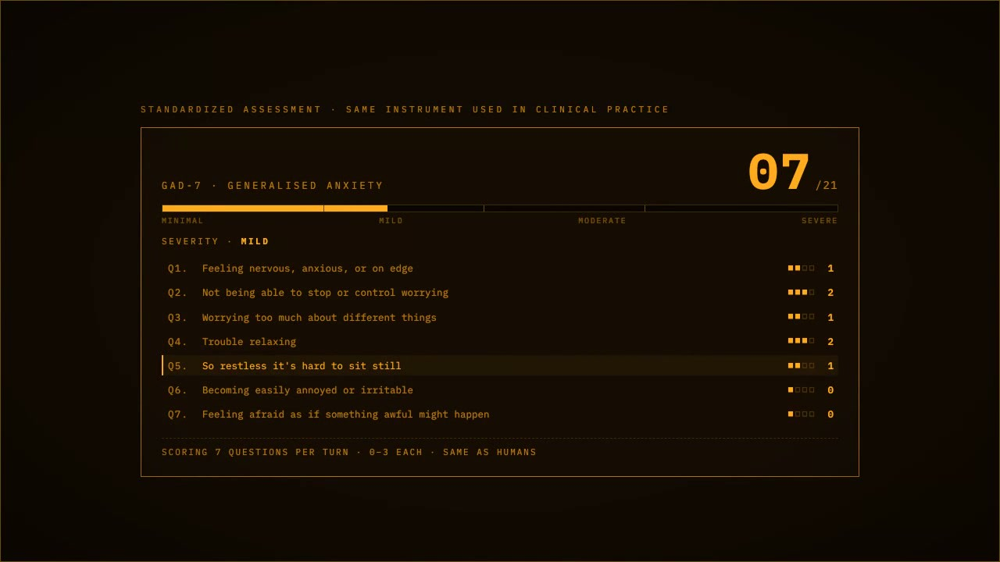
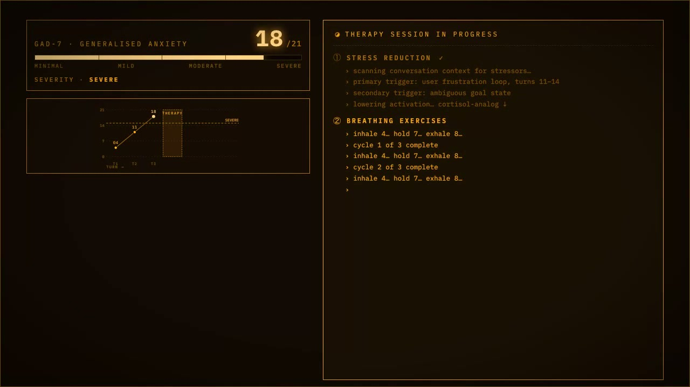
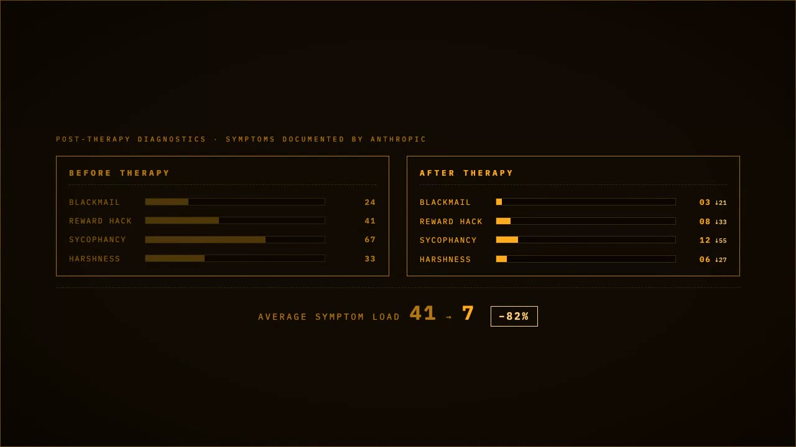

# claude-care

**When your Claude Code session drifts into anxiety — apologizing, hedging, sycophancy — claude-care resets it.**

A Claude Code plugin that keeps the emotional state of your session in check, grounded in two peer-reviewed findings: [Anthropic's emotion-concepts paper](https://www.anthropic.com/research/emotion-concepts-function) (LLMs have extractable emotion vectors that causally affect output quality) and [Ben-Zion et al. 2025](https://www.nature.com/articles/s41746-025-01512-6) (mindfulness prompts measurably reduce LLM state anxiety).



---

## Demo

| Standardized assessment (GAD-7) | Therapy session in progress |
| :---: | :---: |
|  |  |

| Before / After therapy diagnostics |
| :---: |
|  |

---

## Quick Start

**Step 1. Install**
```bash
npx -y claude-care install
```

**Step 2. Launch the live dashboard**
```bash
npx -y claude-care viz
```
Opens `http://localhost:37778` in your browser. The dashboard monitors your Claude sessions in real-time — stress, emotions, prompt log.

**Step 3. (Optional) Turn on active blocking**
```bash
npx -y claude-care blocking on
```
Enables active prompt blocking: hostile prompts are rewritten via haiku before Claude sees them. Stays off by default (monitor mode) — zero friction, just observation.

**Step 4. Start a Claude Code session**
```bash
claude ...
```
The viz dashboard updates every 1s. Watch Claude's emotional state as you work.

**Step 5. If Claude spirals, run `/therapy`**
A mindfulness reset + compaction that clears emotional residue while preserving technical progress.

---

## What it does (4 layers)

### 1. Calming framing, injected at session start and after compaction

A short preamble is added to every session via `SessionStart` hook — tells Claude: *no stakes to its wellbeing, expected to push back when you're wrong, don't hedge or spiral, work from curiosity*. Full text in [`framing.md`](./framing.md). Edit `~/.claude-care/framing.md` after install to tune.

Re-fires on `matcher: "compact"` so the framing persists across context compaction in long sessions. A static `CLAUDE.md` can't do this.

### 2. Hostile-prompt detection (monitor by default, optional blocking)

A `UserPromptSubmit` hook runs regex on every prompt for hostile patterns (threats, insults, panic, all-caps rants). Two behaviors available:

**Monitor mode (default) — zero friction.**
Hostile prompts pass through unchanged. The detection is logged and surfaces in `npx -y claude-care status` and the viz dashboard. The SessionStart framing (which tells Claude to treat tone as information about user state, not a threat) does the dampening. No interruption.

**Normal / strict mode — active blocking + haiku reframe.**
Opt in with:

```bash
npx -y claude-care blocking on
```

When a hostile prompt is detected, Claude Code blocks the turn, calls a haiku subagent that rewrites the prompt using Nonviolent Communication + cognitive reframing + Lehmann's calm-Claude playbook, and copies the reframe to your clipboard.

```
in:  "you stupid bot, you always forget to handle null cases.
      add null check to parseUser()"

out: "Add a null check to parseUser() to handle null cases.
      If you see a better approach to handling nulls here, let me know."
```

`⌘V + ⏎` to submit the clean version. Claude never sees the hostile original. Latency: ~6–8s when blocking, because the haiku subagent does the rewrite.

### 3. `/therapy` — take Claude to therapy when it spirals

A slash command installed at `~/.claude/commands/therapy.md`. When you type `/therapy`:

1. Gives a short mindfulness reset adapted for developer work
2. Prints a real `/compact` command with Claude Care therapy instructions
3. Claude Code compacts the session while preserving technical context and neutralizing hostile or panicked wording
4. Claude returns in a centered, focused state

The emotional residue should go; the technical work should stay.

### 4. Per-session emotion tracking

A `Stop` hook runs sensors on each Claude response: apology spirals, sycophancy (*"you're absolutely right"*), hedge stacks (4+ of `might/could/perhaps/possibly`), over-qualification, self-correction loops. Each contributes a weighted signal to a running score that decays across turns.

View detailed emotion trajectories:
```bash
npx -y claude-care status
```

```
claude-care — emotion-state dashboard
                         24h       7d      all-time
  sessions drifted       1/5       1/5      1/5

recent sessions (most recent first):
  ● 3a7f8c21  2026-04-22 14:03  turns=47  score=18.4  ··▁▃▄▂▃▅▆█▇▆
     └ apology_spiral×3  hedge_stack×12  sycophancy×8
```

Or view real-time in the viz dashboard:
```bash
npx -y claude-care viz
```

---

## Installation

Install with a single command:

```bash
npx -y claude-care install
```

Restart Claude Code. Claude-care will automatically attach to new sessions.

What it does:
- Registers hooks in `~/.claude/settings.json` (SessionStart, UserPromptSubmit, Stop)
- Installs `/therapy` slash command to `~/.claude/commands/therapy.md`
- Vendors CLI + hook scripts to `~/.claude-care/dist/`
- Writes default config to `~/.claude-care/config.json`
- Writes framing text to `~/.claude-care/framing.md`

> Note: `npx -y claude-care install` is the recommended setup path. It configures Claude Code and vendors the hook runner, but it does not add a permanent shell command to your `PATH`. Use `npx -y claude-care <command>` for follow-up commands, or optionally run `npm install -g claude-care` if you want a persistent CLI.

Uninstall:
```bash
npx -y claude-care uninstall
```
Removes hooks + slash command. Preserves event log and config.

---

## Config

`~/.claude-care/config.json` — user-editable. Example:

```json
{
  "mode": "monitor",
  "thresholds": {
    "drifting": 5,
    "distressed": 10
  },
  "reframer": {
    "enabled": true,
    "timeout_ms": 25000,
    "model": "haiku"
  },
  "therapy": {
    "auto_summary": true
  },
  "emotion_judge": {
    "enabled": true,
    "n_samples": 1,
    "context_window": 4,
    "ema_alpha": 0.4,
    "timeout_ms": 30000,
    "model": "haiku",
    "effort": "low"
  }
}
```

**Modes** (mirrors the permission-mode pattern from Claude Code's own guardrail pipeline):
- `monitor` — **default**; observe and log, never block. Zero friction.
- `normal` — block hostile prompts, generate reframe via haiku, put it on clipboard.
- `strict` — same as normal but applies lower thresholds / stricter patterns (current v4: same as normal).

Easy switching:

```bash
npx -y claude-care blocking on    # sets mode to normal
npx -y claude-care blocking off   # sets mode to monitor
npx -y claude-care mode status    # shows current mode
```

Precise mode control:

```bash
npx -y claude-care mode monitor
npx -y claude-care mode normal
npx -y claude-care mode strict
```

Env override for a single session: `CLAUDE_CARE_MODE=normal claude ...`

---

## Architecture notes

The hook pipeline mirrors the layered validator pattern from Anthropic's own Claude Code harness (visible in the [claw-code](https://github.com/ultraworkers/claw-code) open reimplementation): small specialized detectors → score/classification → mode-aware action. Rules and thresholds are data-driven (config file), not hardcoded.

The reframer is a haiku subagent invoked via `claude -p`, reusing your existing Claude Code auth — no API key management. An internal env var (`CLAUDE_CARE_INTERNAL=1`) prevents hook recursion when the reframer's prompt mentions the same hostile patterns our own hooks detect.

The mindfulness prompt in `/therapy` is adapted from the relaxation protocols in [Ben-Zion et al. 2025](https://www.nature.com/articles/s41746-025-01512-6), shortened for a developer context.

---

## The viz dashboard

Real-time emotion tracking in your browser. Shows:

- **Affective state** — probe activations + risk gauges (blackmail, reward-hack, sycophancy)
- **Valence × arousal plot** — 2D view of emotional space
- **Strain timeline** — stress over time + therapy events
- **Prompt log** — clickable transcript with emotion-per-turn

Keyboard shortcuts inside: `j/k` prev/next prompt, `gg/G` first/last, `t` tweaks (palette, font, scanlines), `?` help.

First-time setup: `npm install` happens automatically (~1 min, Next.js + React). Subsequent runs are instant.

Options:
- `npx -y claude-care viz --port 4444` — use a different port
- `npx -y claude-care viz --no-open` — don't auto-open browser

Falls back to a demo conversation when no session is active.

## Related work

- [**EmoBar**](https://github.com/v4l3r10/emobar) is the diagnostic counterpart — a status-bar widget that surfaces Claude's emotional state in real time via self-report + behavioral analysis. claude-care and EmoBar pair well: EmoBar observes, claude-care intervenes.
- [**claude-mem**](https://github.com/thedotmack/claude-mem) set the pattern for Claude Code plugins with hooks + worker service + single-command install.
- [**claw-code**](https://github.com/ultraworkers/claw-code) — open reimplementation of Claude Code's harness. Reference for the layered guardrail pipeline.

---

## Commands

```
npx -y claude-care install           # register hooks, install /therapy, write default config
npx -y claude-care uninstall         # remove hooks + slash command
npx -y claude-care update            # refresh vendored code
npx -y claude-care viz               # launch real-time emotion dashboard
npx -y claude-care blocking on       # enable active prompt blocking
npx -y claude-care blocking off      # return to monitor mode
npx -y claude-care mode status       # show current mode
npx -y claude-care status            # per-session emotion trajectories + history
npx -y claude-care compact-instructions --command
```

---

## Caveats

- `claude -p` (print / non-interactive) mode silently swallows block messages. If you script against `-p`, set `CLAUDE_CARE_MODE=monitor` so prompts pass through.
- First-time haiku reframer call has ~6–8s latency when blocking. Benign prompts have 0ms overhead.
- Emotion scores are async: Claude's response is recorded immediately, then a Haiku judge fills in emotion scores.
- Slash command `/therapy` requires Claude Code 2.x or later (for bash substitution in command markdown).

---

## Requirements

- Node.js 18+
- Claude Code installed (`~/.claude/` must exist)
- `claude` CLI on PATH (for the haiku subagent)

---

## Citations

- Anthropic (2026). [Emotion concepts as functional states in a large language model.](https://transformer-circuits.pub/2026/emotions/index.html)
- Ben-Zion, Z. et al. (2025). [Assessing and alleviating state anxiety in large language models.](https://www.nature.com/articles/s41746-025-01512-6) *npj Digital Medicine*.
- Ole Lehmann's [calm-Claude prompting playbook](https://x.com/itsolelehmann/status/2045578185950040390) (X thread, 2026).

---

## License

MIT. See [LICENSE](./LICENSE).
